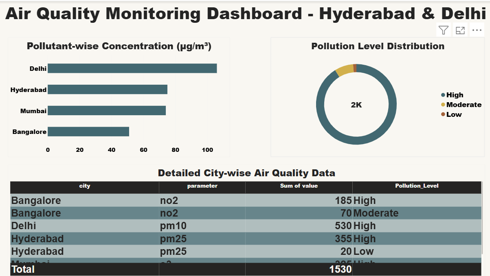

# 🌬️ Air Quality Analytics - Python & Power BI

> End-to-end data pipeline that collects real-time air quality data via API, cleans & transforms it using Python, and visualizes key pollution metrics in an interactive Power BI dashboard.

### 📸 Dashboard Preview

### 🚀 Key Features
- **Automated API Collection:** Fetches live AQI data using `api_collection.py`
- **Data Cleaning & Transformation:** Handles nulls, outliers, and standardizes pollutants (PM2.5, PM10, NO2, etc.)
- **Database Integration:** Loads cleaned data into DB via `db_loader.py`
- **Interactive Power BI Dashboard:** City-wise AQI, PM2.5 trends, pollutant comparison, health risk categories

### 🛠️ Tech Stack
- **Language:** Python (Pandas, Requests, Dotenv)
- **Visualization:** Power BI (Dashboard.pbix)
- **Data:** OpenWeather / Air Quality API
- **Tools:** Git, .env for secure key management

### 📂 Project Structure
